# D01_Linux (allarosb)

## Содержание
1. [Установка ОС](#часть-1-установка-ос)
2. [Создание пользователя](#часть-2-создание-пользователя)
3. [Настройка сети ОС](#часть-3-настройка-сети-ос)
4. [Обновление ОС](#часть-4-обновление-ос)
5. [Использование коанды sudo](#часть-5-использование-команды-sudo)
6. [Установка и настройка службы времени](#часть-6-установка-и-настройка-службы-времени)
7. [Установка и использование текстовых редакторов](#часть-7-установка-и-использование-текстовых-редакторов)
8. [Установка и базовая настройка сервиса SSHD](#часть-8-установка-и-базовая-настройка-сервиса-sshd)
9. [Установка и использование утилит top, htop](#часть-9-установка-и-использование-утилит-top-htop)
10. [Использование утилиты fdisk](#часть-10-использование-утилиты-fdisk)
11. [Использование утилиты df](#часть-11-использование-утилиты-df)
12. [Использование утилиты du](#часть-12-использование-утилиты-du)
13. [Установка и использование утилиты ncdu](#часть-13-установка-и-использование-утилиты-ncdu)
14. [Работа с системными журналами](#часть-14-работа-с-системными-журналами)
15. [Использование планировщика заданий CRON](#часть-15-использование-планировщика-заданий-cron)

 

## Часть 1. Установка ОС
- Скачиваем установочный образ `https://releases.ubuntu.com/24.04/`
- Скачиваем программу для виртуализации `VirtualBox` (файл вида `ubuntu-24.04.X-live-server-amd64.iso`) `https://www.virtualbox.org/wiki/Downloads`
- Создание виртуальной машины
    - Запускаем `VirtualBox`
    - Нажимаем `Создать`
    - Задаем имя вирутальной машины
    - Выбираем установленный образ ICO
    - Задаём имя пользователя и пароль
    - Задаём количество оперативной памяти и процессоров
    - Создаём новый виртуальный диск и выделяем ему размер места
    - Проверяем информацию о созданной виртуальной машине, при готовности нажимаем Готово
- Создание ОС
    - Запускаем созданную вирутальную машину
    - Ждём всех обновлений
    - Вводим логин и пароль
    - Узнаем версию Ubuntu через команду `cat /etc/issue`

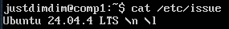
> Результат работы команды `cat /etc/issue`

 

## Часть 2. Создание пользователя
- Создание нового пользователя

> Команда создания нового пользователя

- Проеверяем нового пользователя через команду `cat /etc/passwd`
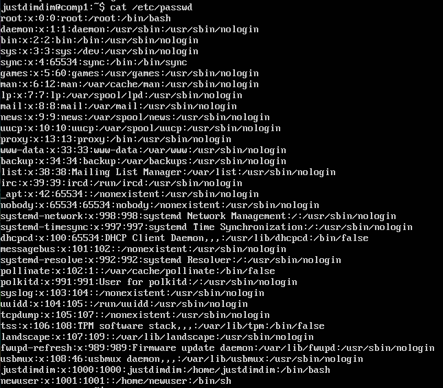
> Результат вызова команды `cat /etc/passwd` (новый пользователь в последней строке)

 

## Часть 3. Настройка сети ОС
- Задаём имя машины вида `user-1`

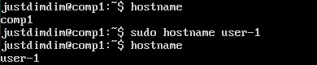
> Процесс изменения имени машины

- Задаём временную зону, соответствующую текущему местоположению

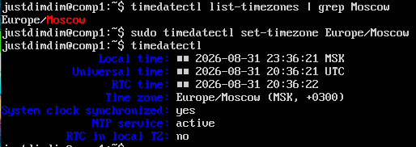
> Процесс изменения временной зоны

- Выводим названия сетевых интерфейсов

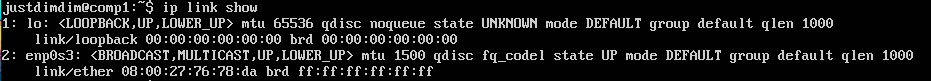
> Вывод сетевых интерфейсов (`lo` - петлевой интерфейс, существующий лишь внутри ОС)

- Получаем `ip`-адрес, на котором я работаю, от `DHCP`-сервера

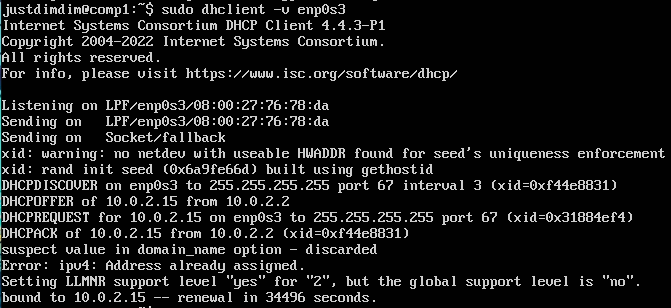
> Информация по `ip`-адресу от `DHCP`-сервера (`DHCP` - Dynamic Host Configuration Protocol (протокол динамической настройки узлов))

- Определяем и выводим на экран внешний и внутренний `ip`-адреса шлюза

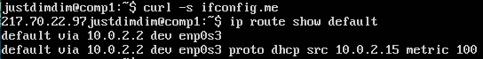
> Первая команда - вывод внешнего `ip`-aдреса шлюза (`ip`), вторая - вывод внутреннего `ip`-aдреса шлюза (`gw`)

- Задаём статичные (заданные вручную, а не полученные от `DHCP`-сервера) настройки `ip`, `gw`, `dns` (используя публичные `DNS`-серверы)

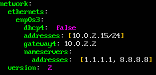
> Через команду `sudo nano /etc/netplan/00-installer-config.yaml` меняем внутри файла на такую информацию

- Перезагружаем виртуальную машину через команду

        sudo reboot

- Убеждаемся, что статичные сетевые настройки (`ip`, `gw`, `dns`) соответствуют заданным в предыдущем пункте.

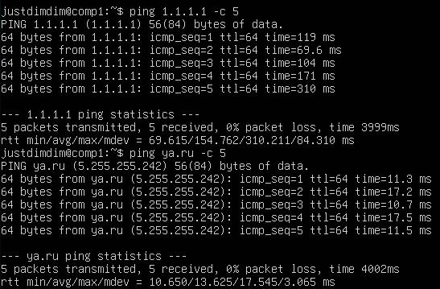
> Пинг удаленных хостов `1.1.1.1` и `ya.ru`

 

## Часть 4. Обновление ОС
- Проверяем установочные пакеты, которые можно обновить, с помощью команды

        sudo apt update

- Обновляем все пакеты до последней версии с помощью команды

        sudo apt upgrade -y

- Вызываем эту же команду повторно

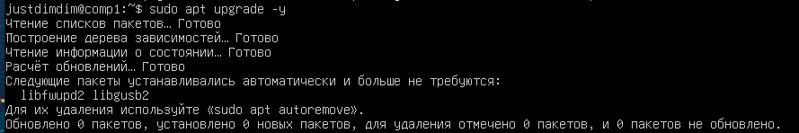
> Результат повторного вызова команды `sudo apt upgrade -y`

 

## Часть 5. Использование команды sudo
- Даем пользователю, созданному в [Части 2](#часть-2-создание-пользователя), права на команду sudo

        sudo usermod -aG sudo <имя пользователя>

`sudo` (SuperUser DO) - утилита для выполнения команд другого пользователя без передачи пароля суперпользователя и с полным логированием всех действий

- Меняем `hostname` от имени пользователя, созданного в [Части 2](#часть-2-создание-пользователя).

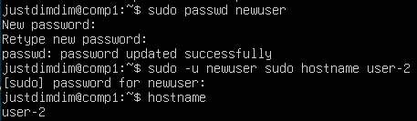
> Процесс изменения `hostname`

 

## Часть 6. Установка и настройка службы времени
- Включаем синхронизацию времени с помощью команды

        sudo timedatectl set-ntp true

- Выводим время часового пояса, в котором я сейчас нахожусь, и затем используем команду `timedatectl show`

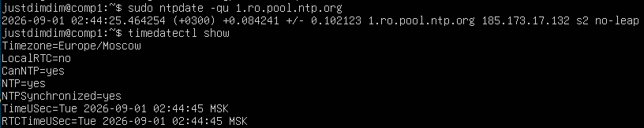
> Скриншот со всем вышеперечисленным

 

## Часть 7. Установка и использование текстовых редакторов
- Устанавлием нужные текстовые редакторы через команду

        sudo apt install <название редактора>

- Создание текстового файла с сохранением изменений
    - Использование текстового редактора `vim`
        - Чтоб создать текстовый файл с помощью `vim`, пишем команду:

                vim test_vim.txt
            
        - Вводим свой никнейм в редактор:

        
        > Содержание файла `test_vim.txt`перед закрытием

        - Чтоб выйти из `vim` с сохранением изменений, сначала нажимаем клавишу:

                Esc
        
            затем пишем:

                :wq

    - Использование текстового редактора `nano`
        - Чтоб создать текстовый файл с помощью `nano`, пишем команду:
        
                nano test_nano.txt
        
        - Вводим свой никнейм в редактор

        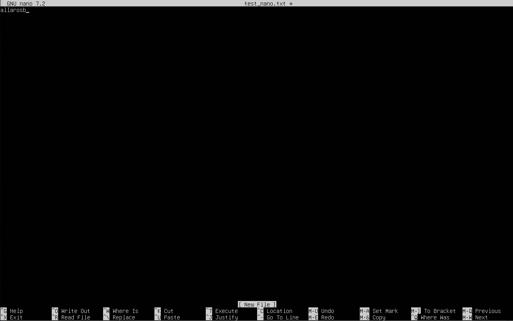
        > Содержание файла `test_nano.txt` перед закрытием

        - Чтоб выйти из `nano` с сохранением изменений, нажимаем в таком порядке сочетания клавиш:

                Ctrl+O -> Enter -> Ctrl+X или Ctrl+X -> Ctrl+Y -> Enter
        
    - Использование текстового редактора `mcedit`
        - Чтоб создать текстовый файл с помощью `mcedit`, пишем команду:

                mcedit test_mcedit.txt
        
        - Вводим никнейм в редактор

        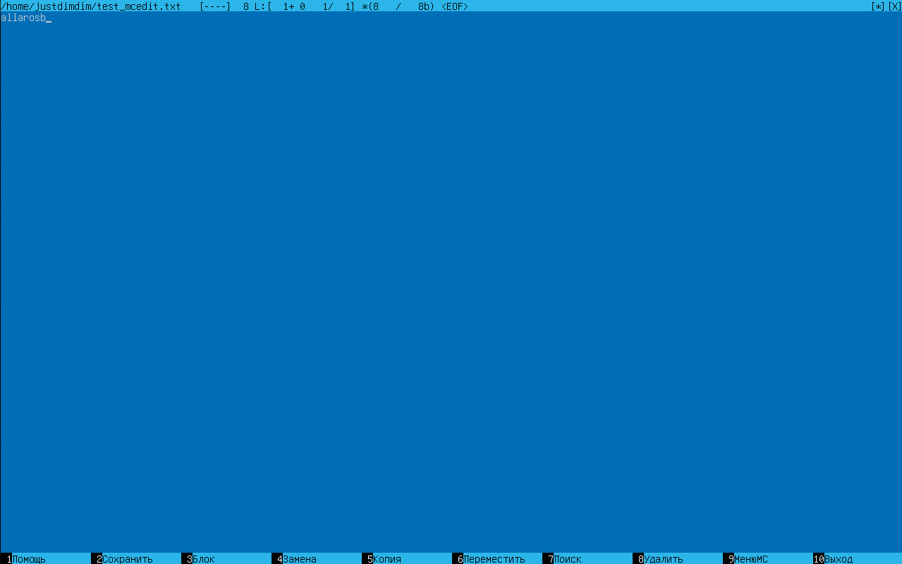
        > Содержание файла `test_mcedit.txt` перед закрытием

        - Чтоб выйти из `mcedit` с сохранением изменений, нажимаем в таком порядке клавиши:

                F2 (в появившемся окне выбираем "Да") -> F10

- Изменение текстового файла без сохранения
    - Использование текстового редактора `vim`
        - Чтоб открыть существующий текстовый файл с помощью `vim`, пишем команду:

                vim test_vim.txt
        
        - Вводим указанную строку в редактор

        
        > Содержимое файла `test_vim.txt` перед закрытием

        - Чтоб выйти из `vim` без сохранения изменений, сначала нажимаем клавишу:

                Esc

            а затем пишем:

                :q!
        
    - Использование текстового редактора `nano`
        - Чтоб открыть существующий текстовый файл через `nano`, пишем команду:

                nano test_nano.txt
        
        - Вводим указанную строку в редактор

        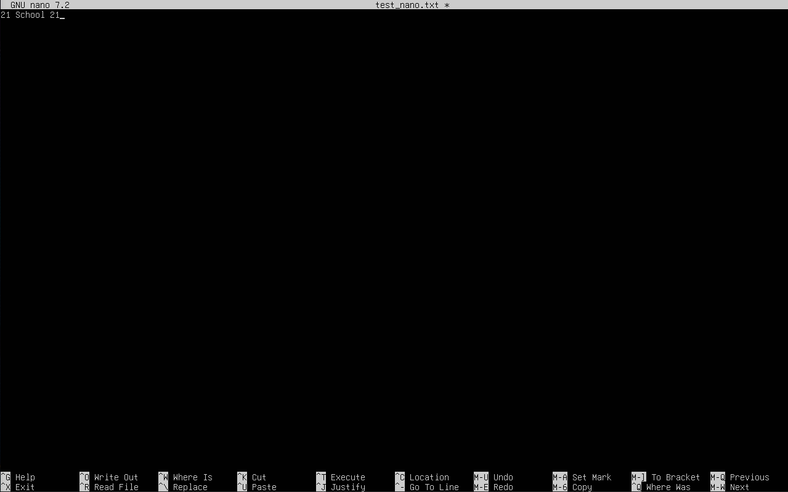
        > Содержимое файла `test_nano.txt` перед закрытием

        - Чтоб выйти из `nano` без сохранения исзменений, нажимаем сочетания клавиш в таком порядке:

                Ctrl+X -> Ctrl+N
    
    - Использование текстового редактора `mcedit`
        - Чтоб открыть существующий текстовый файл через `mcedit`, пишем команду:

                mcedit test_mcedit.txt
        
        - Вводим указанную строку в текстовый редактор

        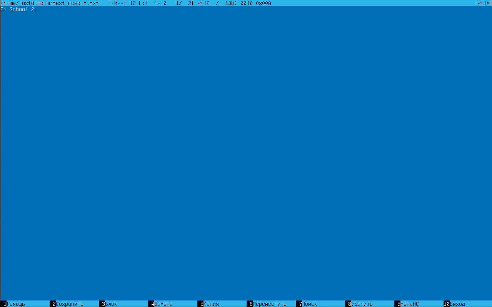
        > Содержимое файла `test_mcedit.txt` перед закрытием

        - Чтоб выйти из `mcedit`, нажимаем клавишу:

                F10 (в появившемся окне выбираем "Нет")
    
- Поиск и замена слов в текстовых редакторах
    - Использование текстового редактора `vim`
        - Зайдя в существующий файл, используя команду `vim test_vim.txt`, изменяем файл

        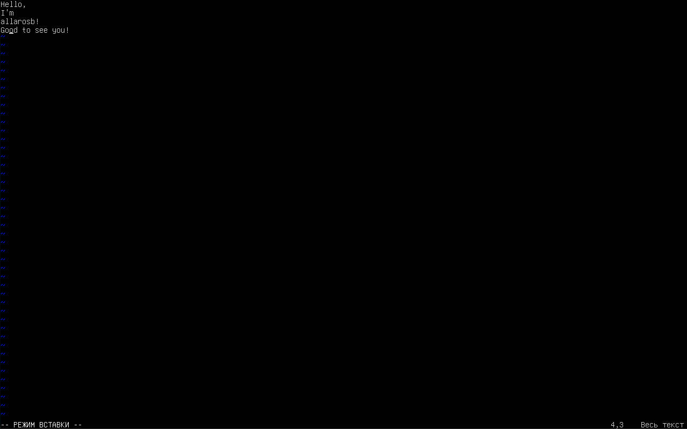
        > Содержимое файла `test_vim.txt` после изменений

        - После нажатия клавиши `Esc` ищем слово, написав:

                /<слово>
        
        
        > Поиск слова `allarosb` в файле `test_vim.txt`

        - Заменяем слово на другое, написав:

                :%s/<прежняя строка>/<новая строка>/g
        
        
        > Замена слова `Hello` на `Hi` в файле `test_vim.txt`
    
    - Использование текстового редактора `nano`
        - Зайдя в существующий файл, используя команду `nano test_nano.txt`, изменяем файл

        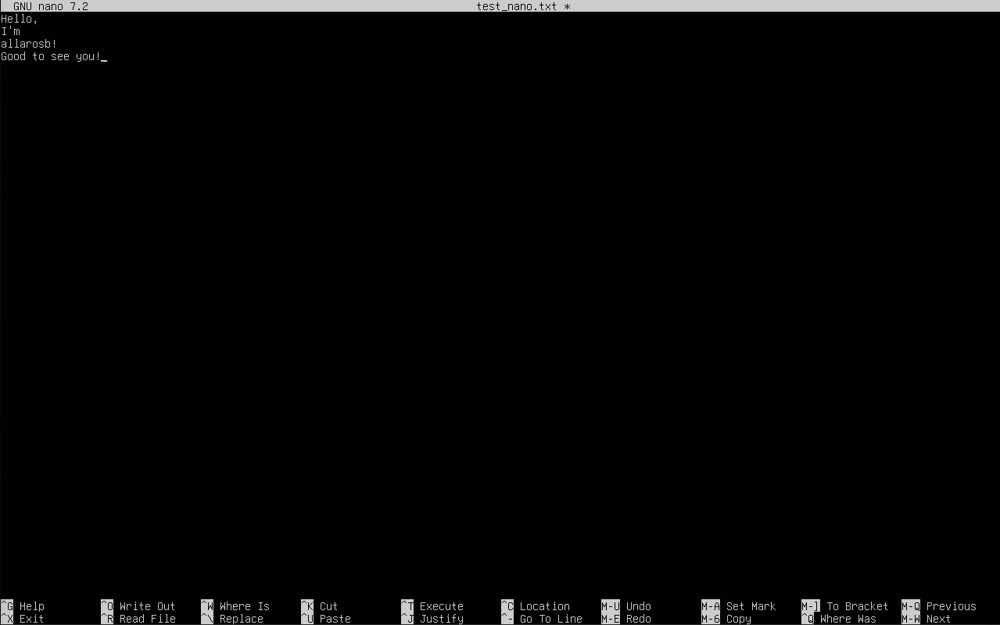
        > Содержимое файла `test_nano.txt` после изменений

        - После нажатия сочетания клавиш `Ctrl+W` ищем слово, написав:

                <слово>
            
            а затем нажав клавишу `Enter`
        
        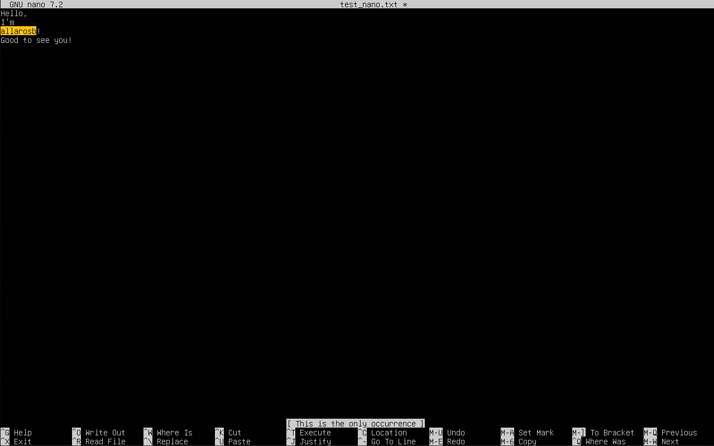
        > Поиск слова `allarosb` в файле `test_nano.txt`

        - После нажатия сочетания клавиш `Ctrl+\` заменяем слово на другое, написав:

                <прежняя строка>
        
            затем после нажатия клавиши `Enter`, пишем:
                
                <новая строка>
            
            и нажимаем клавишу `Enter`

        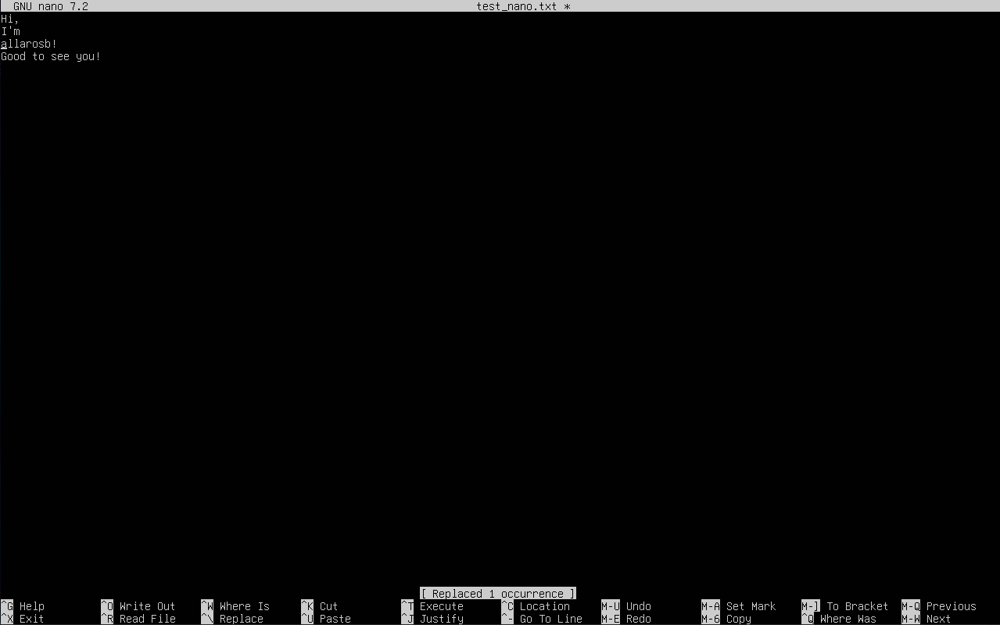
        > Замена слова `Hello` на `Hi` в файле `test_nano.txt`
    
    - Использование текстового редактора `mcedit`
        - Зайдя в существующий файл, используя команду `mcedit test_mcedit.txt`, изменяем файл

        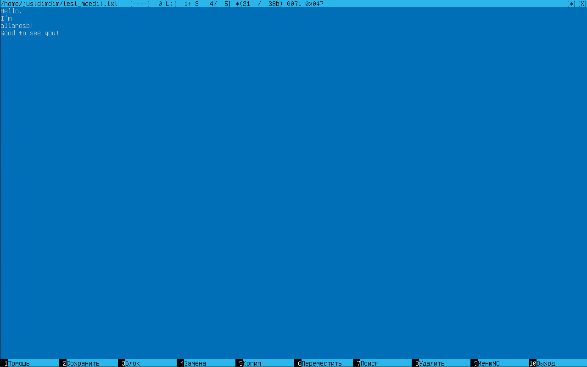
        > Содержимое файла `test_mcedit.txt` после изменений

        - После нажатия клавиши `F7` ищем слово, написав в появившемся окне:

                <слово>
            
            а затем выбрав `Найти всё` (через `Пробел`)
        
        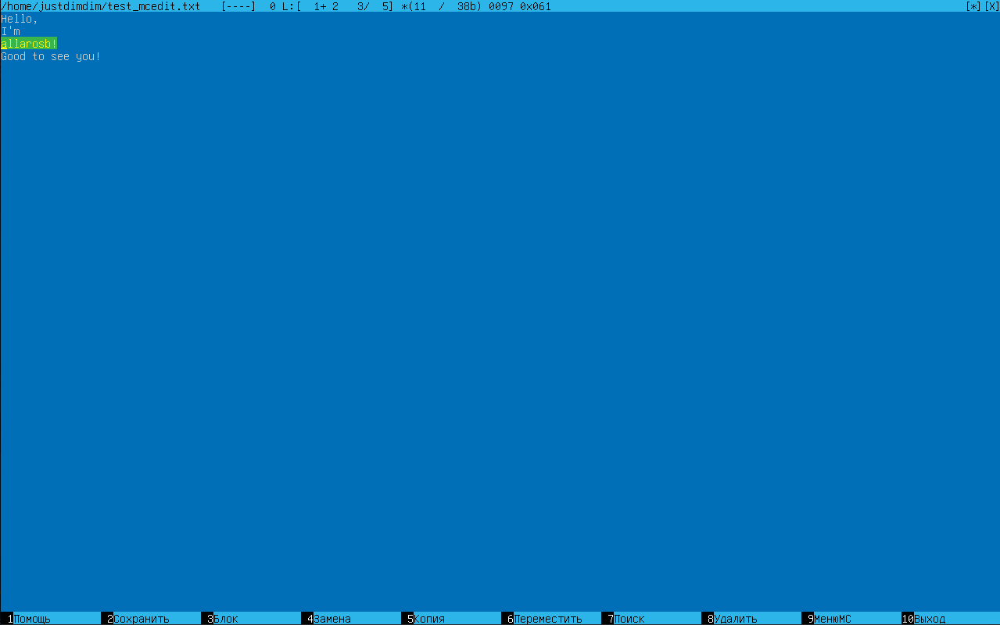
        > Поиск слова `allarosb` в файле `test_mcedit.txt`

        - После нажатия клавиши `F4` заменяем слово на другое, написав в появившемся окне в нужных пунктах:

                <прежняя строка>

                <новая строка>
            
            затем выбираем `Хорошо` (через `Пробел`).
            В новом окне убедившись, что все для замены верно выбираем `Заменить` (через `Пробел`)

        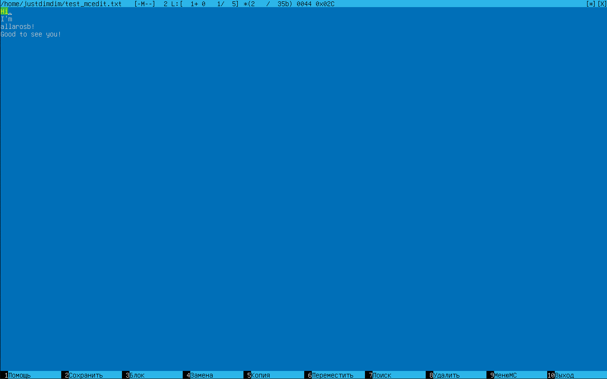
        > Замена слова `Hello` на `Hi` в файле `test_mcedit.txt`

 

## Часть 8. Установка и базовая настройка сервиса SSHD
- Устанавливаем пакет `OpenSSH Server`, содержащий демон `SSHd`, используя команду:

        sudo apt install openssh-server -y

- Добавляем автостарт службы при загрузке системы через команду:

        sudo systemctl enable ssh

- Для перенастраивания службы `SSHd` на порт `2022` редактируем конфигурационный файл `SSH` через команду:

        sudo nano /etc/ssh/sshd_config

- В редакторе меняем строку `#Port 22` на `Port 2022` (именно без `#`)

- Показываем наличие процесса `sshd`, используя команду:

        ps -С sshd
    
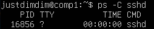
> `ps` - команда для отображения информации о запущенных процессах в системе.

Ключи команды `ps`:
1. `-A, -e, (a)` - показать все процессы
2. `-a` - показать все процессы, кроме фоновых
3. `-d, (g)` - показать все процессы, включая фоновые, кроме процессов сессий
4. `-N` - показать все процессы, кроме указанных
5. `-C` - показать процессы по имени команды
6. `-G` - показать процессы по ID группы
7. `-p, (p)` - показать процессы PID
8. `--ppid` - показать процессы по PID родительского процесса
9. `-s` - показать процессы по ID сессии
10. `-t, (t)` - показать процессы по tty
11. `-u, (U)` - показать процессы пользователя

- Перезагружаем систему с помощью команды:

        sudo reboot

- Перед вводом последующей команды, установим `net-tools`:

        sudo apt install net-tools

- Вводим команду:

        netstat -tan

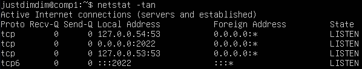
> `-t` - выводит только TCP-соединения, `-a` - отображает все активыне соединения, `-n` - не преобразовывать IP-aдреса в доменные имена, а номера портов в сервисные имена

Столбцы вывода команды `netstat -tan`:
1. `Proto` - транспортный протокол (tcp, tcp6 и т.д.)
2. `Recv-Q` (Receive Queue) - Количество полученных, но ещё не прочитанных приложением байт данных, находящихся в сетевом буфере (`0` - нет данных в очереди, `> 0` - приложение не успевает обрабатывать полученные данные)
3. `Send-Q` (Send Queue) - количество отправленных, но ещё не подтверждённых удалённой стороной байт данных (`0` - все данные подтверждены, `> 0` - удаленная сторона не подтверждает получение данных)
4. `Local Address` - адрес и порт на моей машине, с которого установлено соединение или который слушает сервер (`0.0.0.0:<порт>` - сервер слушает на всех сетевых интерфейсах)
5. `Foreign Address` - адрес и порт удаленной машины, с которой установлено соединение (`0.0.0.0:*` - сервер слушает, ожидая подключения с любого адреса)
6. `State` - текущее состояние TCP-соединения

 

## Часть 9. Установка и использование утилит top, htop
- Устанавливаем `top` и `htop`, используя команду:

        sudo apt install htop -y

- Вызываем команду:

        top

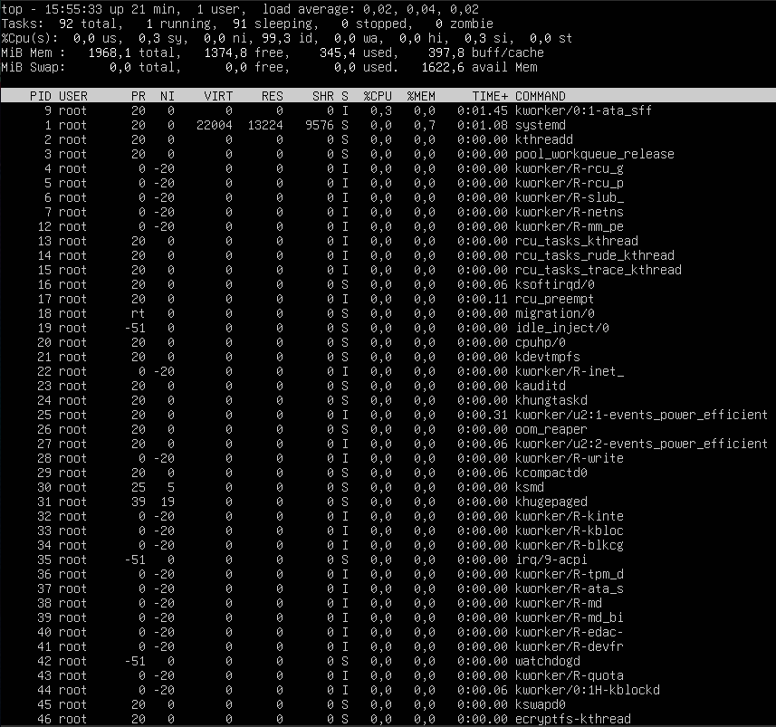
> Вывод команды `top`

- По данному скриншоту определяем данные:
    - Uptime (up ...): `21 минута`
    - Количество авторизованных пользователей (... user): `1`
    - Средняя загрузка системы (load average: ...): `0.02, 0.04, 0.02` (за последнюю 1 минуту, за последние 5 минут, за последние 15 минут соответственно)
    - Общее количество процессов (Tasks: ... total): `92`
    - Загрузка CPU (%Cpu(s): ... us, ... sy): us + sy = 0.0 + 0.3 = `0.3`
    - Загрузка памяти (MiB Mem: ... total, ... used): used / total * 100% = `~17,5%`
    - PID процесса, занимающего больше всего памяти (PID с max %MEM): `1`
    - PID процесса, занимающего больше всего процессорного времени (PID c max %CPU): `9`

- Вызываем команду

        htop

- Выводы команды `htop`:
    - После нажатия клавиши `F2` выбираем `Meters` и добавляем в `Column 1` и `Column 2` параметры `Hostname`, `Clock` и `Uptime` (все последующие скриншоты будут с этими параметрами)
    - После нажатия клавиши `F6` сортируем по нужной колонке:
        
        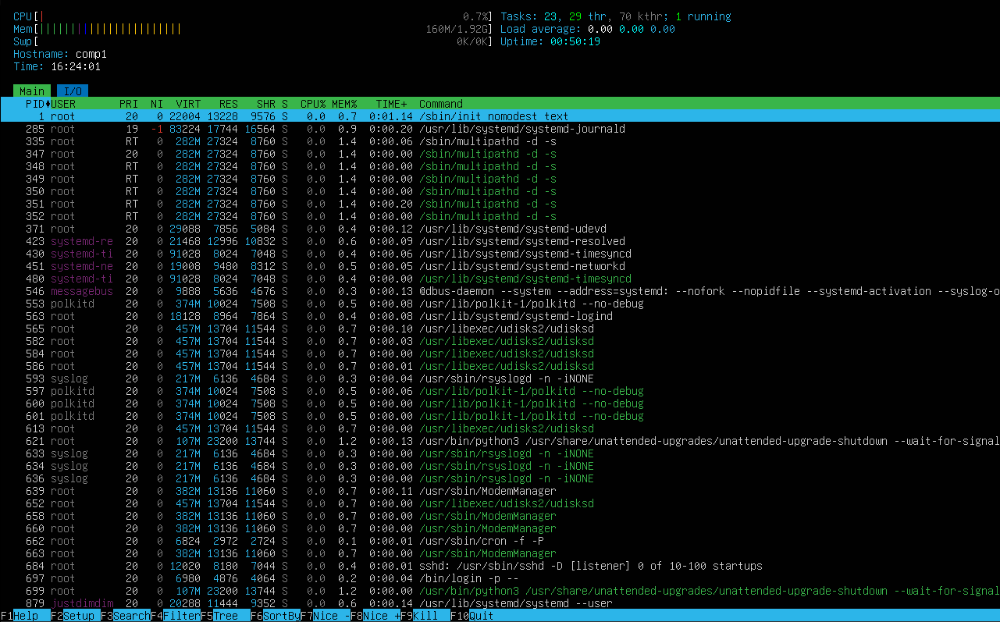
        > Сортировка по `PID`

        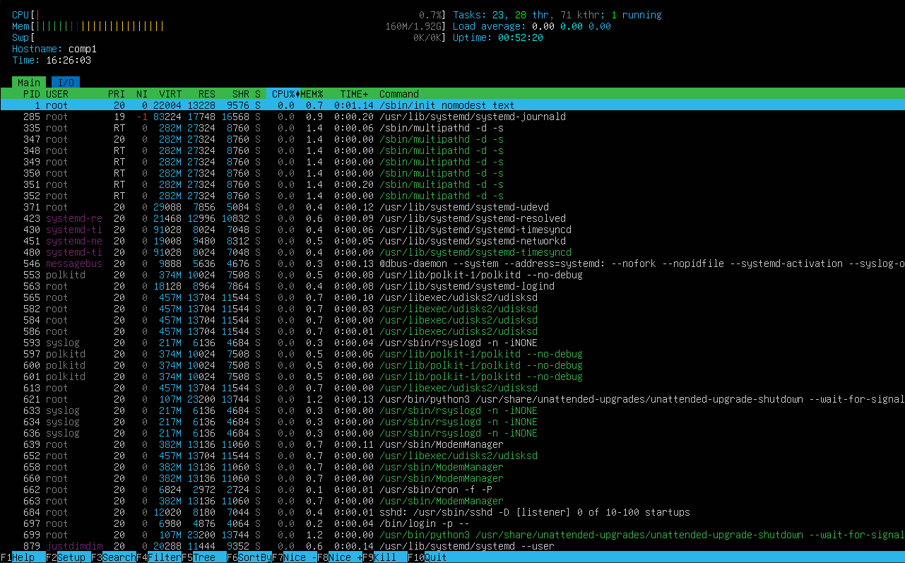
        > Сортировка по `PERCENT_CPU`

        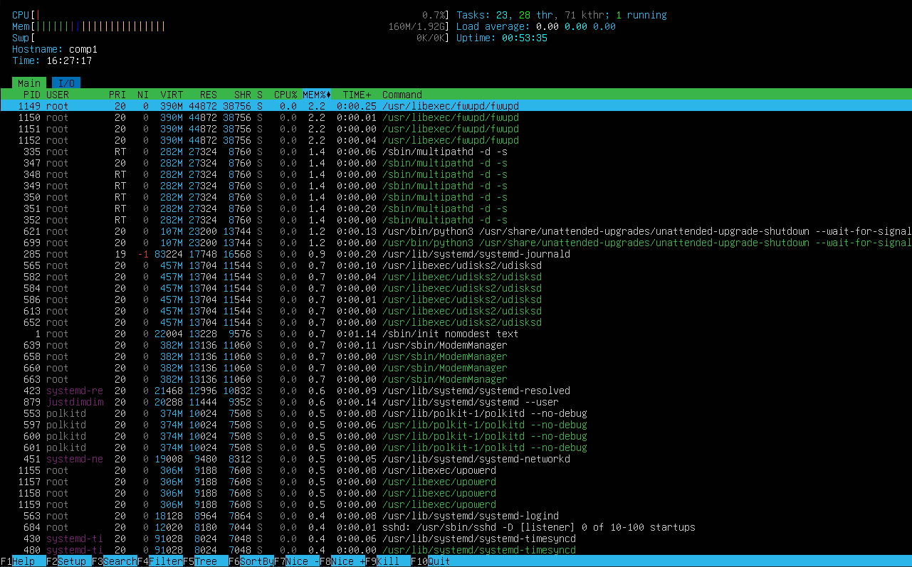
        > Сортировка по `PERCENT_MEM`

        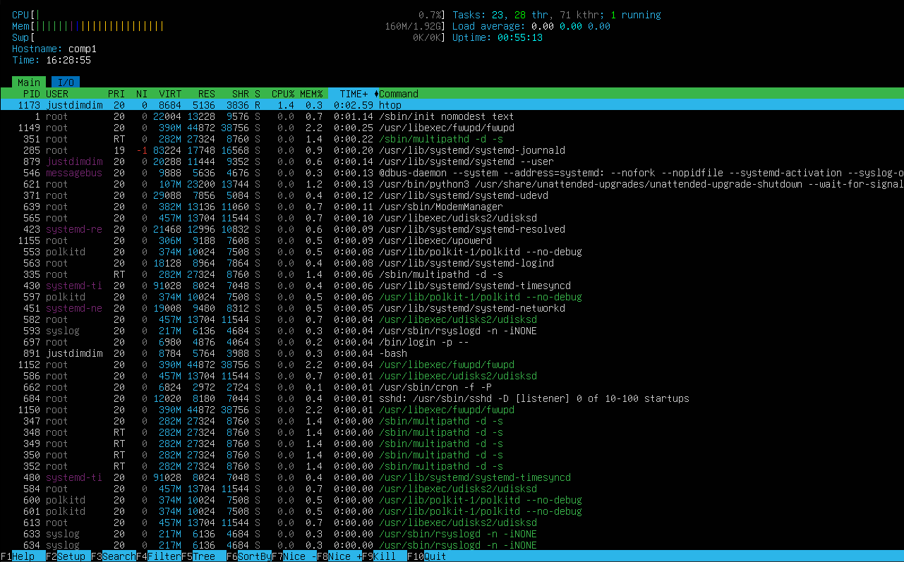
        > Сортировка по `TIME`
    
    - После нажатия клавиши `F4` пишем `sshd` и фильтруем список:

        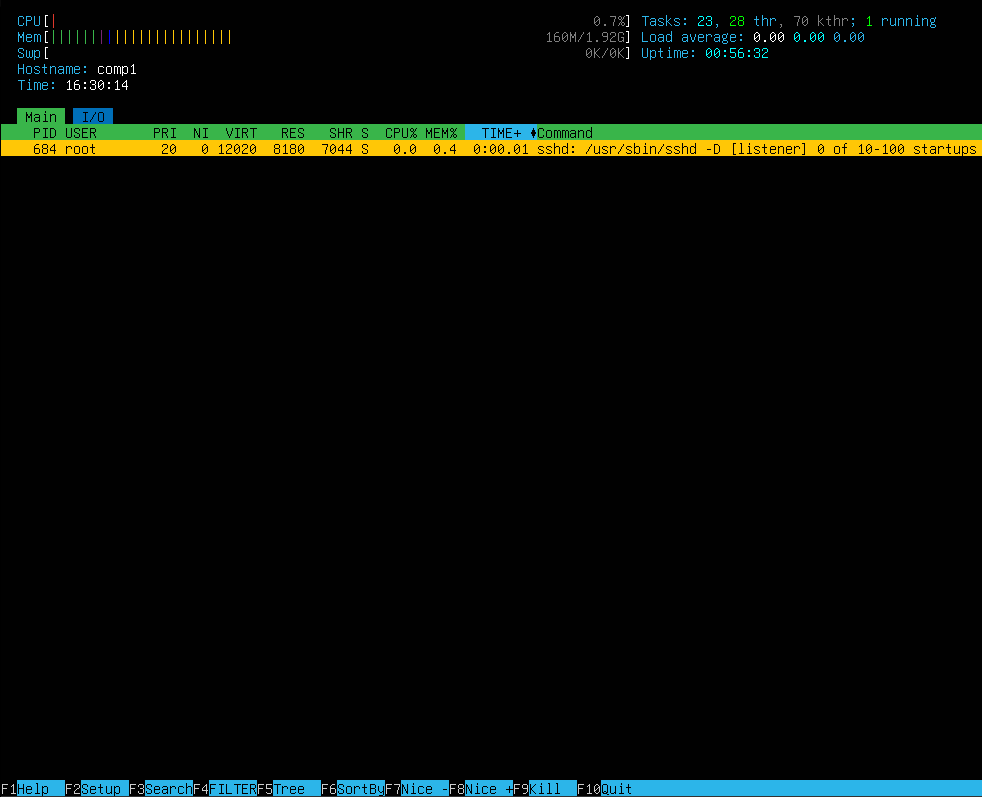
        > Фильтрация для процесса `sshd`
    
    - После нажатия клавиши `F3` пишем `syslog` и находим соответствующий процесс:

        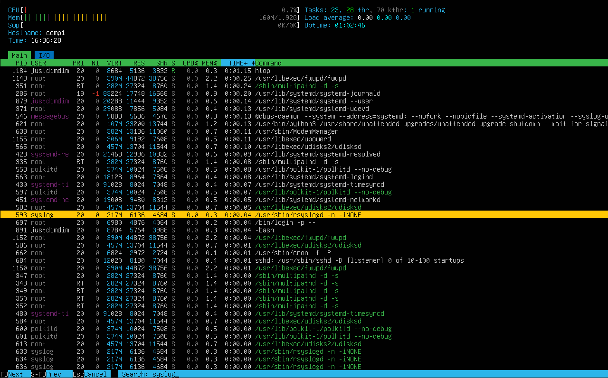
        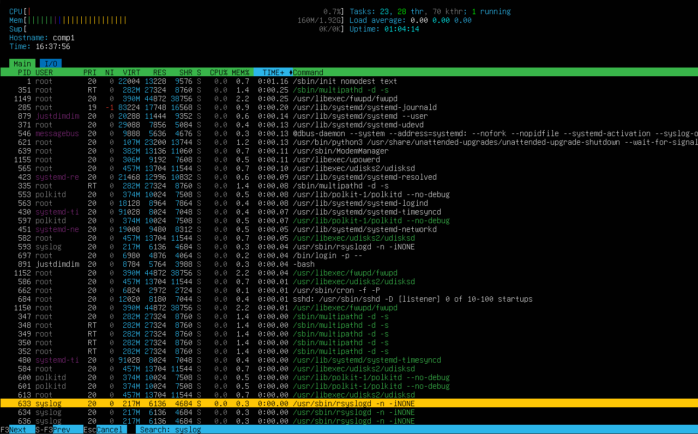
        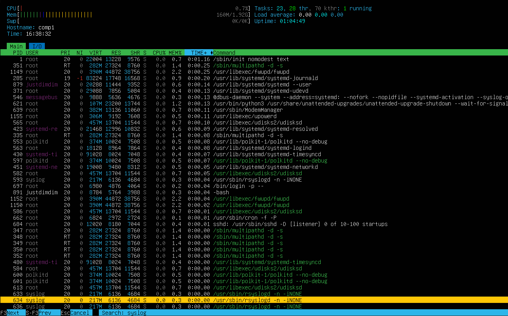
        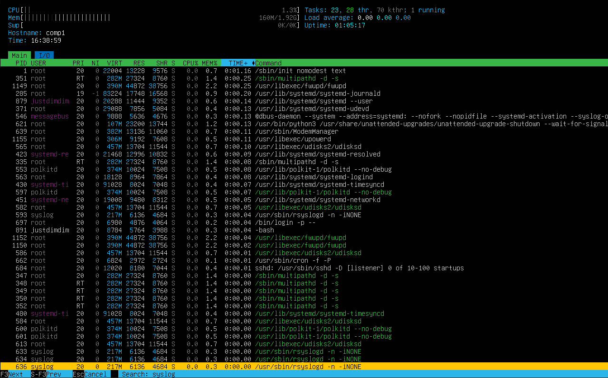
        > Поиск процесса `syslog`
    
 

## Часть 10. Использование утилиты fdisk
- Запускаем команду:

        sudo fdisk -l
    
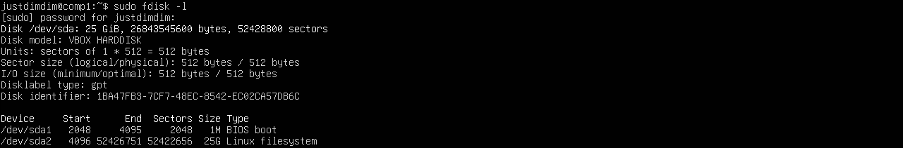
> Вывод команды `sudo fdisk -l`

- По данному скриншоту определяем данные:
    - Название жёсткого диска (Disk ...:): `/dev/sda`
    - Размер жёсткого диска (... GiB): `25 GiB`
    - Количество секторов (... sectors): `52428800`
    - Размер swap-раздела: после проверки командой `swapon --show` выяснилось, что swap не используется

 

## Часть 11. Использование утилиты df
- Запускаем команду:

        df

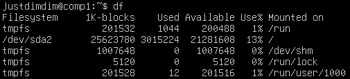
> Вывод команды `df`

- По данному скриншоту определяем данные (в строке, где `Mounted on`: `/`):
    - Размер раздела (1K-blocks): `25623780`
    - Размер занятого пространства (Used): `3015224`
    - Размер свободного пространства (Available): `21281608`
    - Процент использования (Use%): `13%`
    - Единица измерения: `1K-блоки (килобайты)`

- Запускаем команду:

        df -Th

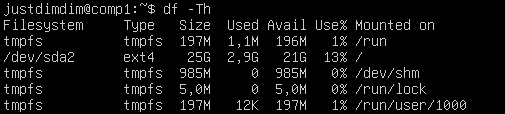
> Вывод команды `df -Th`

- По данному скриншоту определяем данные (в строке, где `Mounted on`: `/`):
    - Размер раздела (Size): `25G`
    - Размер занятого пространства (Used): `2,9G`
    - Размер свободного пространства (Avail): `21G`
    - Процент использования (Use%): `13`
    - Тип файловой системы для раздела: `ext4`

 

## Часть 12. Использование утилиты du
- Запускаем команду

        du

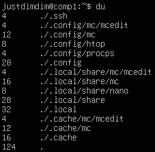
> Вывод команды `du`

- Выводим размеры соответствующих папок с помощью команды в человекочитаемом виде:

        sudo du -sh /<нужная папка>

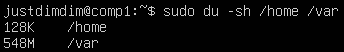
> Вывод размеров папок `/home` и `/var`

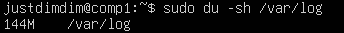
> Вывод размера папки `/var/log`

- Выводим размер всего содержимого в `/var/log` с помощью команды:

        sudo du -sh /var/log/*

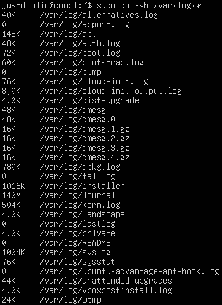
> Вывод размера всего содержимого в `/var/log`

 

## Часть 13. Установка и использование утилиты ncdu
- Устанавливаем пакет ncdu с помощью команды:

        sudo apt install ncdu -y

- Выведем размеры соответствующих папок с помощью команды:

        sudo ncdu /<нужная папка>

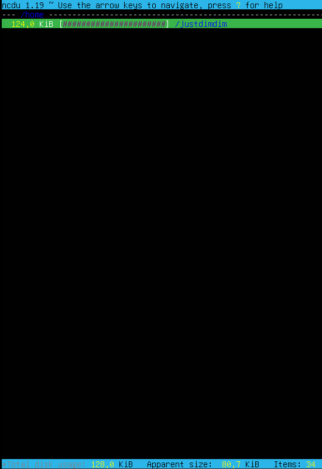
> Вывод размера папки `/home`

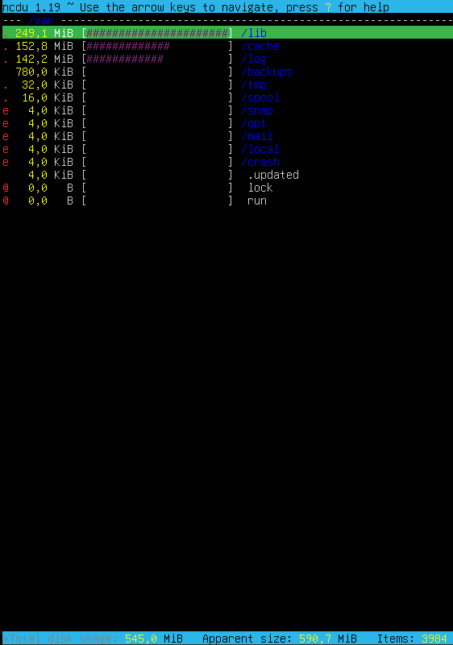
> Вывод размера папки `/var`

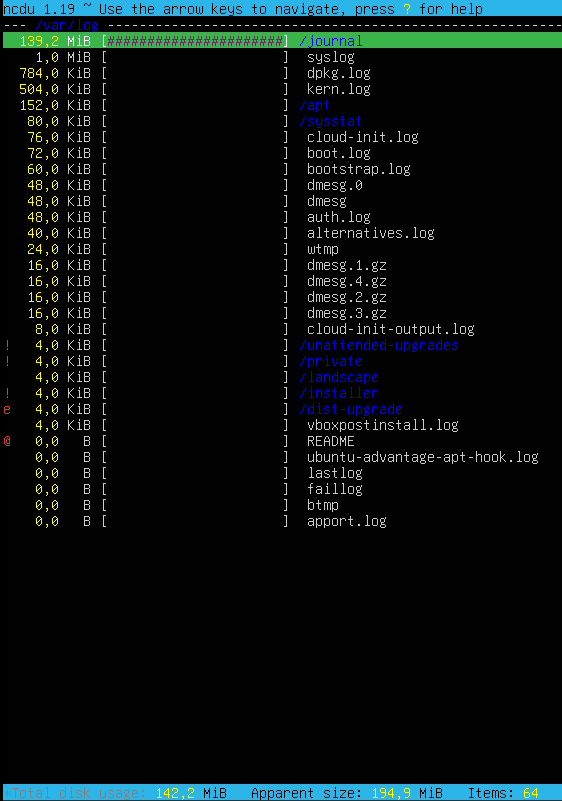
> Вывод размера папки `var/log`

Размеры папок примерно совпадают с размерами из [Часть 12](#часть-12-использование-утилиты-du)

 

## Часть 14. Работа с системными журналами
- Открываем для просмотра нужные папки командами:

        sudo less /var/log/dmesg
        sudo less /var/log/syslog
        sudo less /var/auth.log

- В процессе изучения последней папки находим записи об успешных входах, написав `/Accepted`

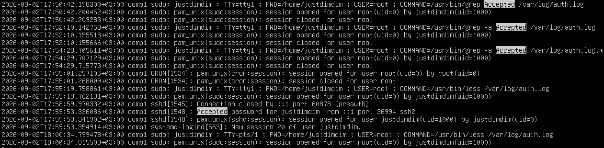
> Записи внутри `/var/auth.log` со служебным словом `Accepted`

- По данному скриншоту определяем данные (в строке `Accepted password ...`):
    - Время последней успешной авторизации: `2026-09-02 17:59:53`
    - Имя пользователя: `justdimdim`
    - Метод входа в систему: `password`

- Перезапускаем службу `SSHd` с помощью команды:

        sudo systemctl restart ssh

- Находим сообщение о рестарте службы с помощью команды:

        sudo less /var/log/syslog | tail -10

> По последним 5 строкам видно, что система перезапускалась

 

## Часть 15. Использование планировщика заданий CRON
- Редактируем файл crontab через команду:

        crontab -e

    выбираем текстовый редактор из предложенных (например, nano)
- В открывшемся редакторе добавляем в конец строку (полный путь к команде uptime можно получить через команду `which uptime`)

        */2 * * * * /usr/bin/uptime >> /tmp/uptime.log 2>&1

- Находим в системных журналах строчки о выполнении через команду:

        sudo grep -a "uptime" /var/log/syslog | tail -10

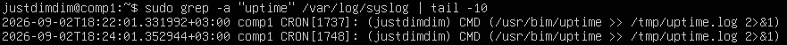
> Строки о выполнении в системных журналах

- Выводим список текущих заданий для `CRON` через команду:

        crontab -l

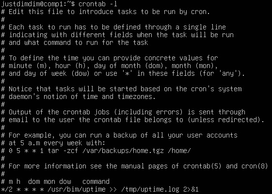
> Список текущих заданий для `CRON`

- Удаляем все задания из планировщика заданий с помощью команды

        crontab -r -i

> `-i` запрашивает подтверждение перед удалением
- Запросим список текущих заданий для `CRON` с помощью команды:

        crontab -l

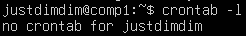
> Список пуст (все задачи очищены)